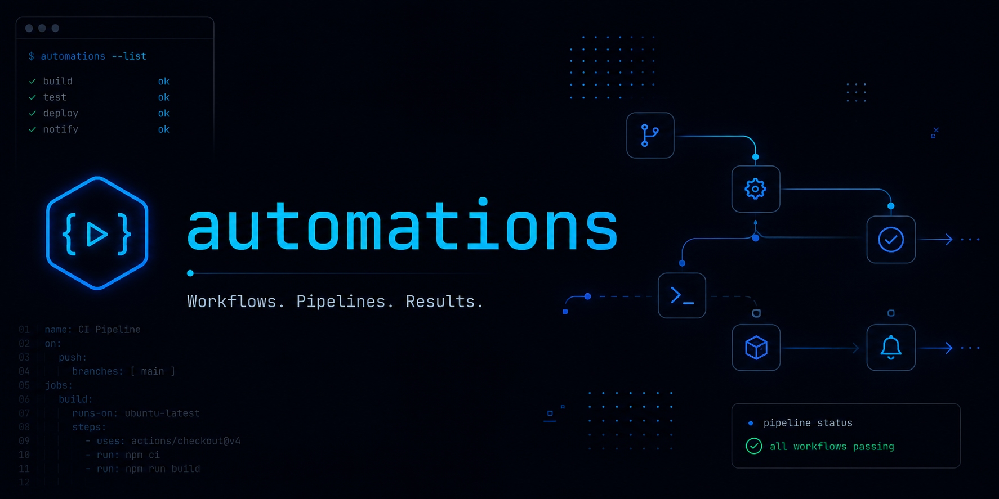

# Automations

This folder contains all available Codex automations. Each automation lives in its own folder and comes with everything you need to get started.

---

## How to pick the right automation

Not sure where to start? Ask yourself:
- What task do I want to automate?
- How much time do I spend on it every week?
- Do I need it to run once, or on a schedule?

Browse the list below, click into any folder, and read its README.md. Every automation explains exactly what it does before asking you to install anything.

---

## Available Automations

| Name | Description | Difficulty | Status |
|------|-------------|------------|--------|
| [email-digest](./email-digest/) | Scan Gmail for emails from any source, label them, and receive a clean daily digest in your inbox | Intermediate | Stable |

---

## Difficulty Levels

**Beginner** — No coding required. Copy, paste, done. If you can follow a recipe, you can install these.

**Intermediate** — Requires basic familiarity with APIs or environment variables. A quick Google will fill any gaps.

**Advanced** — Involves custom configuration, multiple services, or scripting. Best if you're comfortable in a terminal.

---

## How to install an automation

Every automation follows the same pattern:

**Step 1 — Choose your automation**
Open its folder and read the README.md first. Understand what it does and what it needs.

**Step 2 — Check the requirements**
Each automation lists what you need (API keys, accounts, tools). Set these up before installing.

**Step 3 — Install**
Follow the install steps in the automation's README.md. Most automations can be set up in under 10 minutes.

**Step 4 — Test it**
Run the automation once manually to confirm it works before setting up any schedules.

**Step 5 — You're done**
The automation runs on its own from here. Check back if anything changes in your setup.

---

## Folder structure

Every automation follows this structure:

    automation-name/
    ├── README.md           ← Start here. What it does, how to install, how to use.
    ├── manifest.json       ← Machine-readable metadata (name, version, requirements)
    └── instructions/
        ├── README.md       ← Start here. Install skill first, then automation.
        ├── skill.md        ← How to install the skill into Codex
        └── automation.md   ← How to set up the automation that runs the skill

---

## Need help?

- Read the automation's README.md carefully — most questions are answered there.
- Open an issue on this repo if something is broken or unclear.
- Pull requests are welcome if you want to improve an existing automation.

---

## Want to contribute your own automation?

1. Fork this repo
2. Create a new folder under automations/ with your automation name
3. Follow the folder structure above
4. Submit a pull request with a clear description

Keep it simple, well-documented, and tested. That's it.
