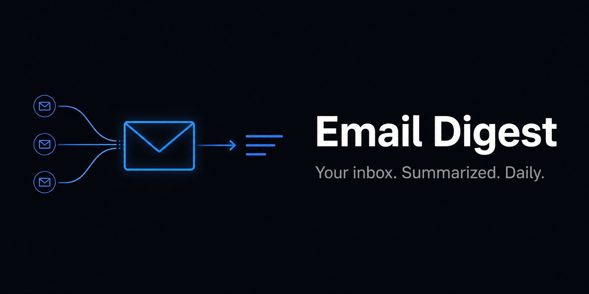

# 📬 Email Digest

Turn any recurring email source into a clean daily brief — delivered straight to your inbox.

This automation scans your Gmail for emails matching keywords you define, organizes them under a label, and sends you a summarized digest every day. No more opening ten emails to find out what matters.

---

## How it works

```
Gmail (today's emails)
        ↓
Filter by your keywords
        ↓
Apply a label to each match
        ↓
Summarize key points + action items
        ↓
Send digest to your own inbox
        ↓
Label the digest email
```

---

## What you can use it for

- Community newsletters → get a single daily brief instead of scattered emails
- Client updates → filter by domain, read one summary each morning
- Job alerts → consolidate daily job board emails into one scan
- Team digests → summarize internal project update threads
- Any recurring email source → if it hits your inbox regularly, this handles it

---

## Requirements

- Gmail account connected via [Composio](https://composio.dev)
- Codex with automations enabled
- Composio tools enabled:
  - `GMAIL_FETCH_EMAILS`
  - `GMAIL_ADD_LABEL_TO_EMAIL`
  - `GMAIL_CREATE_EMAIL_LABEL`
  - `GMAIL_SEND_EMAIL`

---

## Setup

**1. Connect Gmail to Composio**
Go to [composio.dev](https://composio.dev) → Integrations → connect your Gmail account. Enable the four tools listed above.

**2. Open `instructions.md`**
Fill in the three variables at the top:

| Variable | What it does | Example |
|----------|--------------|---------|
| `SOURCE_KEYWORDS` | What Codex searches for in subject/body | `"newsletter, weekly update"` |
| `SOURCE_LABEL` | Label applied to matching emails | `"Newsletter"` |
| `DIGEST_LABEL` | Label applied to your digest email | `"Newsletter Essential"` |

**3. Paste into Codex**
Copy the full contents of `instructions.md` into a new Codex automation.

**4. Set your schedule**
Configure the automation to run daily at your preferred time (e.g. 08:00 every morning).

**5. Test it**
Run once manually. Check your inbox for the digest and confirm labels are applied correctly.

---

## Digest format

```
Subject: 📬 [Your Label] Daily Digest — June 6, 2025

#1. sender@example.com — Subject Line
- Main point
- Action item or deadline
- Anything upcoming or forward-looking

---
⚡ Highlights: What matters most today across all emails.
🎯 Action required: Items needing a response. (Or: "Nothing today.")
```

---

## Troubleshooting

**No digest received**
Confirm Gmail is connected in Composio and your keywords match actual email content. Run manually once to debug.

**Labels not appearing**
Ensure `GMAIL_CREATE_EMAIL_LABEL` is enabled — the automation creates labels automatically if they don't exist.

**Wrong language in digest**
Edit the digest template section in `instructions.md` to set your preferred output language.

---

*Part of [codex-automations](https://github.com/SelcukOzbilgi/codex-automations) — plug-and-play Codex automations by [@SelcukOzbilgi](https://github.com/SelcukOzbilgi)*
